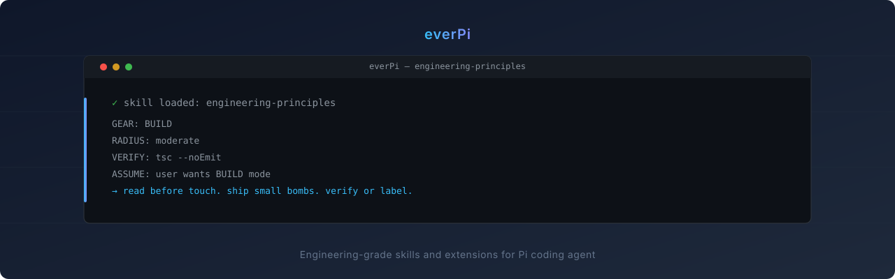

<p align="center">
  
</p>

<p align="center">
  Engineering-grade skills for the <a href="https://github.com/earendil-works/pi">Pi</a> coding agent.
</p>

<p align="center">
  
  
  
</p>

---

## What Is This

A curated pack of **Pi skills** for coding agents that need fewer speeches and better engineering habits: read the repo, make the smallest safe change, and verify the result.

These are not magic prompts. They are operating rails for agents doing real work in messy codebases.

**What makes these different:**

- **Read-first workflow** — inspect code, state, and blast radius before touching files.
- **SHIP vs BUILD gear** — prototype quickly when the work is disposable; require verification when others depend on it.
- **Practical patterns** — streaming dedup, stale-lock detection, atomic file writes, fork/adapt/deploy checks, and other failure modes agents hit in production repos.
- **Public and portable** — plain Markdown skills with a tiny package manifest. No runtime framework required.

## Skills

| Skill | What It Does |
|-------|-------------|
| [engineering-principles](skills/engineering-principles/) | Operating protocol for coding work: start gate, blast radius, bug-fix flow, anti-pattern self-review, and verification discipline. **Load before source-code tasks.** |
| [github-hygiene](skills/github-hygiene/) | GitHub workflow for commits, PRs, issues, releases, changelog management, fork hygiene, and repo cleanliness. |
| [improve-codebase-architecture](skills/improve-codebase-architecture/) | Architecture review and deepening: module boundaries, seams, adapters, locality, leverage, and refactor execution. |
| [loop-engineering](skills/loop-engineering/) | Design safe recurring Pi agent loops: discovery, isolation, verifier gates, persistent state, schedules, budgets, human gates, and extension/MCP upgrade triggers. |
| [google-workspace](skills/google-workspace/) | 49 Google Workspace tools via a zero-dependency Python CLI: Calendar, Gmail, Drive, Docs, Sheets, Contacts, and Tasks. Direct REST API; no SDK. |

## Install

### Via Pi

```bash
pi install git:github.com/everfacture/everPi
/reload
```

### Manual

```bash
# Copy one skill into Pi's skills directory
cp -r skills/<name> ~/.pi/agent/skills/
```

### Verify

After install, Pi should discover the skills automatically. Test with:

```text
/load skill engineering-principles
```

## Structure

```text
everPi/
├── assets/                 # README banner and graphics
├── skills/                 # Pi skills (SKILL.md + references/)
│   ├── engineering-principles/
│   ├── github-hygiene/
│   ├── google-workspace/
│   ├── improve-codebase-architecture/
│   └── loop-engineering/
├── scripts/check_repo.py   # Repo validation used by CI
├── AGENTS.md               # Agent rules for this repo
├── CHANGELOG.md            # Release history
├── CONTRIBUTING.md         # How to add/change skills
├── LICENSE                 # MIT
├── package.json            # Pi package metadata
└── README.md
```

## Quality Gate

Run the same check GitHub Actions runs:

```bash
python3 scripts/check_repo.py
```

It validates skill frontmatter, package metadata, Python syntax, tracked-file hygiene, README claims, and obvious secret patterns.

## Versioning

This repo uses **repo-level semver** for the installable skill pack:

- **Patch** — docs, typo fixes, validation, attribution, non-behavioural cleanup.
- **Minor** — new skill, new workflow, or meaningful new capability.
- **Major** — removed/renamed skills, breaking install layout, or changed invocation contract.

Individual skills do not need separate versions unless they become separately installable packages.

## Credits

Skills and references build on open-source work and public engineering practice:

- **Pi** — built for [earendil-works/pi](https://github.com/earendil-works/pi), originally known in some docs as `badlogic/pi-mono`.
- **improve-codebase-architecture** — vocabulary adapted from [Matt Pocock's skill](https://github.com/mattpocock/skills/blob/main/skills/engineering/improve-codebase-architecture/SKILL.md), extended with workflow and execution rules.
- **google-workspace** — adapted from [tolmachevmaxim/google-workspace-cli](https://github.com/tolmachevmaxim/google-workspace-cli).
- **engineering-principles / code-craft** — influenced by public writing and practice from Pieter Levels, Peter Steinberger, and Andrej Karpathy; rewritten here as concrete Pi operating rules.

## Contributing

See [CONTRIBUTING.md](CONTRIBUTING.md). TL;DR:

- **Add a skill:** create `skills/<name>/SKILL.md` with frontmatter (`name`, `description`) and procedural content.
- **Check it:** run `python3 scripts/check_repo.py`.
- **Keep it small:** one job per skill, references only when they shorten future work.

## License

MIT — see [LICENSE](LICENSE).
